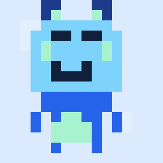

# Pixeloids



Static, framework-agnostic SVG avatar generator for minimal quirky monster characters.

## Install

Until the package is on the npm registry, install from GitHub:

```bash
npm install github:nicolasleao/pixeloids
```

## Usage (Node)

```js
const Pixeloids = require('pixeloids');

const svg = Pixeloids.createSvg('demo-seed', { size: 160 });
const avatar = Pixeloids.createAvatar('demo-seed');

console.log(avatar.svg);
console.log(avatar.metadata);
```

## Browser

```html
<script src="./pixeloids.js"></script>
<script>
  const svg = Pixeloids.createSvg('demo-seed', { size: 160 });
</script>
```

If you are working from a clone without installing it as a dependency, use `require('./pixeloids.js')` instead.

## Files

- `pixeloids.js` — zero-dependency library file (this is what the installable package contains)

### Repository files
- `assets/style.css` — demo page styles
- `assets/pixeloids-demo.gif` — README preview (regenerate with `npm run generate:readme-gif`)
- `index.html` — single-page demo and live previewer

## API

- `createSvg(seed, options)`
- `getMetadata(seed, options)`
- `createAvatar(seed, options)`
- `toDataUri(svg)`

Options: `size`, `background`, `margin`, `title`, `transparentBackground`.

Deterministic trait output is based on a stable hash of `seed + version` and a Mulberry32 PRNG.
Render options like `size`, `margin`, and `title` change presentation without changing the underlying character.

Each avatar is rendered as a sharp pixel-art-inspired monster with a separate head and body, a guaranteed readable face, and a small curated trait set for stronger silhouettes.
